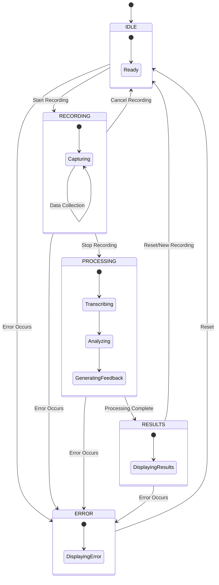

# State Management Diagram

This diagram shows the state transitions for the Voice-Based AI Communication Coach application.



## State Data

Each state can have associated data:

### IDLE
- No specific data

### RECORDING
- `recordingStartTime`: When the recording began
- `audioDuration`: Current duration of the recording

### PROCESSING
- `audioData`: The recorded audio data
- `processingStage`: Current processing stage (transcribing, analyzing, etc.)

### RESULTS
- `transcription`: The transcribed text
- `analytics`: Speech analytics results
- `feedback`: Generated feedback

### ERROR
- `error`: Error details
- `errorSource`: Component where the error occurred

## Observer Pattern

Components can subscribe to state changes:

```typescript
// Example of a component subscribing to state changes
stateService.subscribe({
  update: (state, data) => {
    // Update component based on new state and data
    if (state === AppState.RESULTS) {
      this.showResults(data.transcription, data.feedback);
    }
  }
});
```
